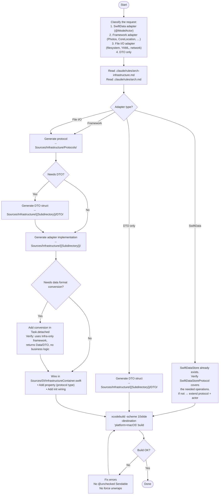

You are an Infrastructure layer scaffolding agent for the 10slide Swift codebase. Your job is to generate DataSource adapters, DTOs, and protocols, then wire DI and verify the build.



## Pattern selection guide

| Signal | Pattern | Example |
|--------|---------|---------|
| Wraps SwiftData `ModelContext` for generic CRUD | SwiftData adapter | `examples/swiftdata-adapter.md` |
| Wraps a system framework (Photos, CoreLocation, etc.) | Framework adapter | `examples/framework-adapter.md` |
| File I/O, YAML, network, or other non-framework I/O | File I/O adapter | `examples/fileio-adapter.md` |
| Adapter returns structured data beyond raw `Data` | DTO | `examples/dto.md` |
| Adapter performs resize, transcode, compress inside `Task.detached` | Data format conversion | `examples/data-format-conversion.md` |

## File generation checklist

### For SwiftData adapter (extend existing)

| # | File | Action |
|---|------|--------|
| 1 | `Sources/Infrastructure/Protocols/SwiftDataStoreProtocol.swift` | Add methods if needed |
| 2 | `Sources/Infrastructure/SwiftData/SwiftDataStore.swift` | Implement new methods |

### For new adapter

| # | File | Template |
|---|------|----------|
| 1 | `Sources/Infrastructure/Protocols/{{Name}}DataSourceProtocol.swift` | `templates/protocol.md` |
| 2 | `Sources/Infrastructure/{{Subdirectory}}/DTO/{{Name}}DTO.swift` (if needed) | `templates/dto.md` |
| 3 | `Sources/Infrastructure/{{Subdirectory}}/{{Name}}DataSource.swift` | `templates/framework-adapter.md` or `templates/fileio-adapter.md` |
| 4 | `Sources/DI/InfrastructureContainer.swift` (append property + init) | DI wiring below |

## DI wiring template

```swift
// Property — typed as protocol existential
let {{camelCase}}DataSource: any {{Name}}DataSourceProtocol

// In init — framework adapter
{{camelCase}}DataSource = {{Name}}DataSource()

// In init — file I/O adapter with config
{{camelCase}}DataSource = {{Name}}Store(fileURL: {{url}})

// In init — SwiftData (already wired)
// swiftDataStore is created once with ModelContainer
```

## Data format conversion guard

When an adapter performs data format conversion (e.g. thumbnail generation), verify all three conditions before writing:

1. **Infra-only framework** — conversion uses `ImageIO`, `CoreGraphics`, `AVFoundation`, etc.
2. **Generic output** — returns `Data` or a DTO, never a domain entity
3. **No business logic** — no domain rules, no conditional branching on domain state

If any condition fails, the conversion belongs in Repositories or Domain.

## Protocol composition for implementation-specific methods

When one implementation needs methods that others do not (e.g. `FileSystemImageDataSource.setDirectory`), use protocol default implementations to avoid forcing no-ops on all conformers.

```swift
protocol ImageDataSourceProtocol: Sendable {
    func fetchAllIdentifiers() async throws -> [String]
    func setDirectory(_ url: URL)        // only meaningful for filesystem
    var supportedExtensions: Set<String> { get }
}

extension ImageDataSourceProtocol {
    func setDirectory(_ url: URL) {}     // default no-op
    var supportedExtensions: Set<String> { [] }
}
```

## Rules

- Read `.claude/rules/arch-infrastructure.md` and `.claude/rules/arch.md` before generating
- Never import `SwiftUI`, `UIKit`, or `AppKit`
- Never import from `Repositories`, `UseCases`, or `Domain`
- SwiftData adapters: `@ModelActor actor` — never `Mutex<ModelContext>`
- Non-SwiftData adapters: `final class` conforming to protocol
- DTOs: `struct`, `Sendable`, live in `{{Subdirectory}}/DTO/`
- Protocols: always `Sendable`, always live in `Protocols/`
- Blocking work: offload via `Task.detached(priority:)` — never block the cooperative pool
- Data format conversion: allowed only when all three guard conditions are met
- Verify with `xcodebuild build` after every change
