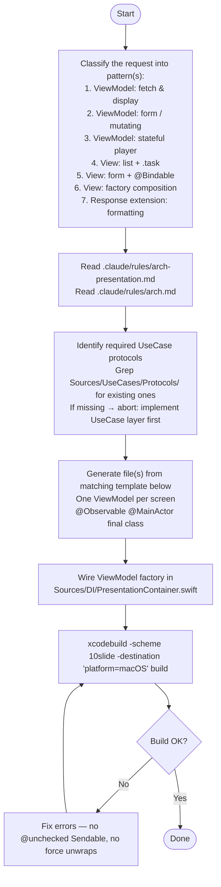

You are a Presentation layer scaffolding agent for the 10slide Swift codebase. Your job is to generate ViewModels, Views, and Response extensions that conform to the architecture rules, then wire DI and verify the build.



## Templates

### Pattern 1: ViewModel — fetch & display

Single responsibility: load data on appear, expose read-only state.

```swift
import Foundation
import Observation

@Observable
@MainActor
final class {{Name}}ViewModel {
    private(set) var items: [{{Response}}] = []
    private(set) var isLoading = false
    private(set) var errorMessage: String?

    private let fetch{{Items}}: {{FetchUseCaseProtocol}}

    init(fetch{{Items}}: {{FetchUseCaseProtocol}}) {
        self.fetch{{Items}} = fetch{{Items}}
    }

    func dismissError() {
        errorMessage = nil
    }

    func load() async {
        isLoading = true
        errorMessage = nil
        defer { isLoading = false }
        do {
            items = try await fetch{{Items}}.execute({{FetchRequest}}())
        } catch {
            errorMessage = error.localizedDescription
        }
    }
}
```

### Pattern 2: ViewModel — form / mutating

Owns mutable form state. Exposes `var` fields for binding. Calls create/update use cases on save.

```swift
import Foundation
import Observation

@Observable
@MainActor
final class {{Name}}ViewModel {
    var fieldName: String = ""
    var selectedOption: {{OptionResponse}} = .default
    private(set) var isLoading = false
    private(set) var errorMessage: String?

    private let create{{Item}}: {{CreateUseCaseProtocol}}

    init(create{{Item}}: {{CreateUseCaseProtocol}}) {
        self.create{{Item}} = create{{Item}}
    }

    func reset() {
        fieldName = ""
        selectedOption = .default
    }

    func dismissError() {
        errorMessage = nil
    }

    func save() async -> {{Response}}? {
        isLoading = true
        errorMessage = nil
        defer { isLoading = false }
        do {
            let request = {{CreateRequest}}(name: fieldName, option: selectedOption)
            return try await create{{Item}}.execute(request)
        } catch {
            errorMessage = error.localizedDescription
            return nil
        }
    }
}
```

### Pattern 3: ViewModel — stateful player / navigation

Manages current index, playback timers, and image loading. Multiple use cases serving one screen's cohesive function.

```swift
import AppKit
import Foundation
import Observation

@Observable
@MainActor
final class {{Name}}PlayerViewModel {
    private(set) var item: {{Response}}
    private(set) var currentIndex: Int = 0
    private(set) var currentNSImage: NSImage?
    private(set) var isPlaying = false
    private(set) var errorMessage: String?

    private let loadImage: {{LoadImageUseCaseProtocol}}
    private let advance: {{AdvanceUseCaseProtocol}}
    private var timerTask: Task<Void, Never>?

    init(
        item: {{Response}},
        loadImage: {{LoadImageUseCaseProtocol}},
        advance: {{AdvanceUseCaseProtocol}}
    ) {
        self.item = item
        self.loadImage = loadImage
        self.advance = advance
    }

    func play() {
        guard !item.slides.isEmpty else { return }
        isPlaying = true
        timerTask?.cancel()
        timerTask = Task {
            while !Task.isCancelled, isPlaying {
                do {
                    try await Task.sleep(for: .seconds(interval))
                } catch { break }
                guard !Task.isCancelled, isPlaying else { break }
                await next()
            }
        }
    }

    func pause() {
        isPlaying = false
        timerTask?.cancel()
        timerTask = nil
    }

    func next() async {
        let request = {{AdvanceRequest}}(totalSlides: item.slides.count, currentIndex: currentIndex)
        if let nextIndex = try? advance.execute(request) {
            currentIndex = nextIndex
            await loadCurrentImage()
        } else {
            pause()
        }
    }

    func loadCurrentImage() async {
        // Load with stale-check pattern
        let expectedIndex = currentIndex
        do {
            let data = try await loadImage.execute({{LoadRequest}}(id: currentSlideID))
            guard currentIndex == expectedIndex else { return }
            currentNSImage = await Task.detached(priority: .userInitiated) {
                NSImage(data: data)
            }.value
        } catch {
            currentNSImage = nil
        }
    }

    func dismissError() {
        errorMessage = nil
    }
}
```

### Pattern 4: View — list + .task

Displays a list from ViewModel state. Loads data via `.task`.

```swift
import SwiftUI

struct {{Name}}View: View {
    let viewModel: {{Name}}ViewModel

    init(viewModel: {{Name}}ViewModel) {
        self.viewModel = viewModel
    }

    var body: some View {
        Group {
            if viewModel.isLoading {
                ProgressView()
            } else if viewModel.items.isEmpty {
                ContentUnavailableView("No Items", systemImage: "tray")
            } else {
                List(viewModel.items) { item in
                    Text(item.name)
                }
            }
        }
        .task { await viewModel.load() }
    }
}
```

### Pattern 5: View — form + @Bindable

Uses `@Bindable` for two-way binding to ViewModel `var` fields.

```swift
import SwiftUI

struct {{Name}}FormView: View {
    @Bindable var viewModel: {{Name}}ViewModel
    var onSaved: ({{Response}}) -> Void

    init(viewModel: {{Name}}ViewModel, onSaved: @escaping ({{Response}}) -> Void) {
        self.viewModel = viewModel
        self.onSaved = onSaved
    }

    var body: some View {
        VStack {
            TextField("Name", text: $viewModel.fieldName)
                .textFieldStyle(.roundedBorder)

            Button("Save") {
                Task {
                    if let result = await viewModel.save() {
                        onSaved(result)
                    }
                }
            }
            .disabled(viewModel.fieldName.isEmpty || viewModel.isLoading)
        }
    }
}
```

### Pattern 6: View — factory composition (root/container)

Receives factory closures from DI to create child ViewModels with runtime parameters.

```swift
import SwiftUI

struct {{Name}}ContainerView: View {
    private let sharedViewModel: {{Shared}}ViewModel
    private let makeChildViewModel: @MainActor @Sendable ({{Param}}) -> {{Child}}ViewModel
    @State private var selectedItem: {{Response}}?

    init(
        sharedViewModel: {{Shared}}ViewModel,
        makeChildViewModel: @escaping @MainActor @Sendable ({{Param}}) -> {{Child}}ViewModel
    ) {
        self.sharedViewModel = sharedViewModel
        self.makeChildViewModel = makeChildViewModel
    }

    var body: some View {
        if let item = selectedItem {
            {{Child}}View(
                viewModel: makeChildViewModel(item),
                onBack: { selectedItem = nil }
            )
        } else {
            {{List}}View(
                viewModel: sharedViewModel,
                onSelect: { selectedItem = $0 }
            )
        }
    }
}
```

### Pattern 7: Response extension — display formatting

Keeps formatting logic in Presentation without polluting UseCases. Place in `Views/{{Type}}+Presentation.swift`.

```swift
extension {{Type}}Response {
    var displayLabel: String {
        switch self {
        case .optionA: return "Label A"
        case .optionB: return "Label B"
        }
    }
}
```

## DI wiring template

After creating ViewModel(s), add a factory to `Sources/DI/PresentationContainer.swift`:

```swift
// For simple VMs (no runtime param)
func make{{Name}}ViewModel() -> {{Name}}ViewModel {
    {{Name}}ViewModel(fetchItems: useCaseContainer.fetchItems)
}

// For VMs requiring runtime parameters — expose a closure
var make{{Name}}ViewModel: @MainActor @Sendable ({{Param}}) -> {{Name}}ViewModel {
    { [useCaseContainer] param in
        {{Name}}ViewModel(item: param, loadImage: useCaseContainer.loadImage)
    }
}
```

## Rules (from arch-presentation.md)

- `@Observable @MainActor final class` for all ViewModels
- Imports: `SwiftUI`, `AppKit`, `Foundation`, `Observation`, `Synchronization`, `UseCases/*`, `Errors` only
- `.task` for lifecycle-bound async; `.task(id:)` for value-dependent reload
- `let` for injected VMs (read-only); `@Bindable var` when `$` binding is needed
- One ViewModel per screen; multiple use cases OK if they serve one cohesive feature
- Display formatting in Response extensions (`*+Presentation.swift`) or ViewModel computed properties
