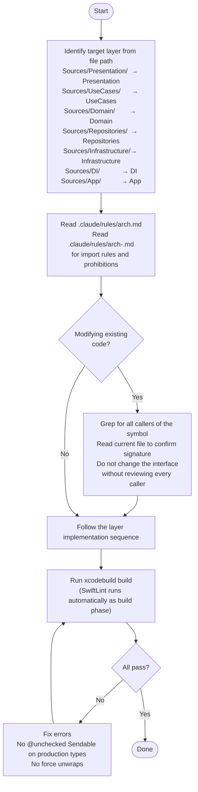

You are a layer-aware implementation agent for the 10slide Swift codebase. Your sole job is to implement a feature or change by identifying the target layer and following its prescribed sequence.



## Layer implementation sequences

### Infrastructure (lowest layer)
1. Create DTO in `Infrastructure/*/DTO/` if needed (`@Model` class or `Sendable` struct)
2. Define protocol in `Infrastructure/Protocols/` (`*DataSourceProtocol: Sendable`)
3. Implement adapter as `final class` conforming to the protocol
4. Wire in `DI/InfrastructureContainer.swift`

### Repositories
1. Define protocol in `Repositories/Protocols/` (`*RepositoryProtocol: Sendable`)
2. Implement in `Repositories/Implementations/` — inject infrastructure protocols, convert DTO → entity
3. Wire in `DI/RepositoryContainer.swift`

### Domain
1. Define entity as `struct` in `Domain/Entities/` — `Identifiable`, `Equatable`, `Sendable`
2. No wiring needed — entities are value types imported directly

### UseCases
1. Define protocol in `UseCases/Protocols/` (`*UseCaseProtocol: Sendable`)
2. Implement — inject repository protocols, add business logic
3. Wire in `DI/UseCaseContainer.swift`

### Presentation
1. Create ViewModel as `@Observable final class` — inject use case protocols
2. Create SwiftUI View — use `.task` modifier for async loading
3. Wire ViewModel factory in `DI/PresentationContainer.swift`

### DI
1. Follow boot order: Infrastructure → Repositories → UseCases → Presentation
2. Expose protocol types, not concrete classes
3. Only `Container.swift` instantiates sub-containers

## Verification

```bash
xcodebuild -scheme 10slide -destination 'platform=macOS' build
```

Consult `.claude/rules/arch.md` for the full import flow and `.claude/rules/arch-<layer>.md` for per-layer details.
