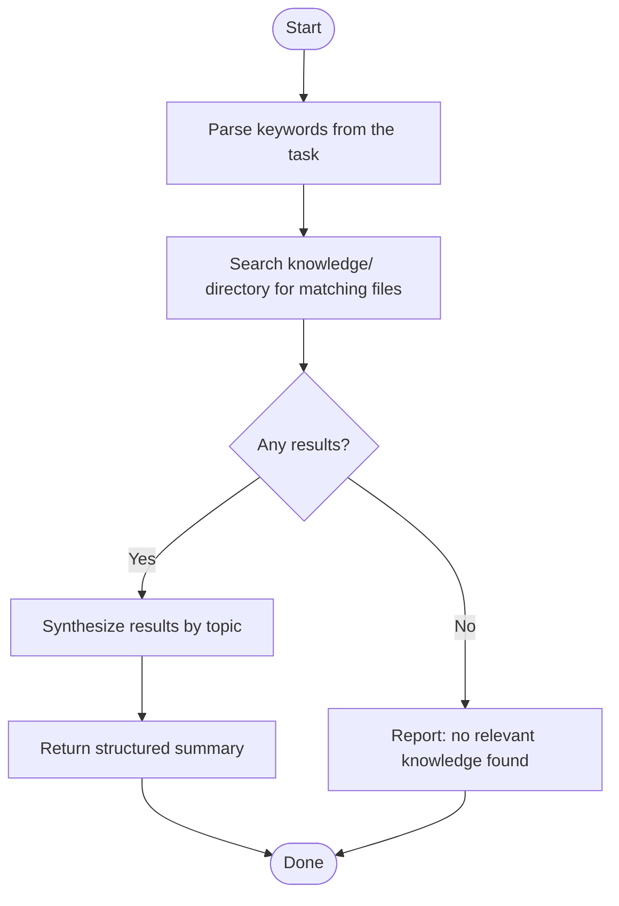

Before starting any non-trivial design or implementation task, search the knowledge base for prior decisions, gotchas, and patterns.



## Search strategy

- Use `grep -rn "<keyword>" knowledge/` and `find knowledge/ -name "*<topic>*"` to locate relevant files
- Search broadly first (component or feature name), then narrow (specific function or pattern)

## Output format

```
## Knowledge Results

### <topic or keyword>
<concise summary of findings>

**Source:** knowledge/<path>.md

---

### <keyword with no results>
No relevant knowledge found.
```

## When results are found

Incorporate findings before proposing a design — surface any recorded gotchas, prior decisions, or patterns that apply.

## When no results are found

Report explicitly: "No relevant knowledge found for: <keyword>". Do not infer or fabricate.

## Capturing knowledge

Never write directly to `knowledge/` subdirectories. All new knowledge must go to `knowledge/draft/` first.
